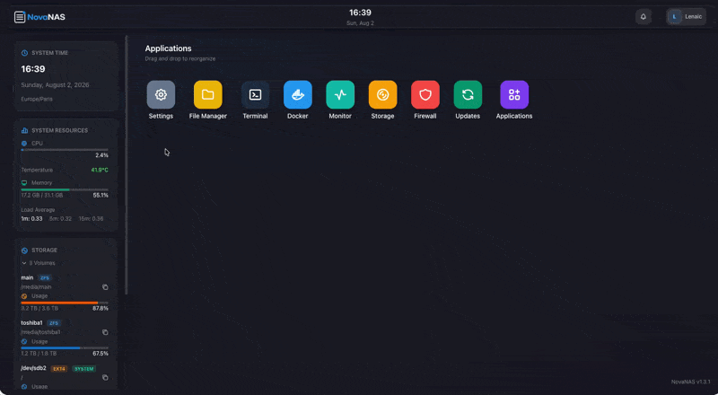

<p align="center">
  
</p>

# NovaNAS

**An Open Source NAS Operating System - A Complete Alternative to CasaOS, Unraid and more**

NovaNAS is a powerful, open-source NAS operating system designed as a comprehensive alternative to other NAS OS. It provides a desktop-like interface that allows you to manage your entire system through a single, intuitive web application.

<p align="center">
  
</p>

<p align="center">
  <a href="#why-novanas">Why NovaNAS?</a> •
  <a href="#features">Features</a> •
  <a href="#installation">Installation</a> •
  <a href="#usage">Usage</a> •
  <a href="#architecture">Architecture</a> •
  <a href="#community">Community</a> •
  <a href="#faq">FAQ</a> •
  <a href="#license">License</a>
</p>

## Why NovaNAS?

CasaOS offers basic NAS functionality, but lacks the depth and completeness needed for serious home or small business storage solutions. NovaNAS fills this gap by providing enterprise-grade features comparable to commercial solutions like QNAP OS or Synology DSM, while remaining fully open-source and free.
I loved using a QNAP NAS for years because their OS is a banger. But it's not a real linux you can use however you want, it's not open source, and a QNAP NAS is expensive (and you can't upgrade components, use a GPU...). I swaped to a DYI NAS and tries many OS like CasaOS that I loved, but it lacks features to be fully usable via it's web UI.
I tried to offer a complete experience through the NovaNAS UI making you feel all powerful via a web interface, without the need of using SSH to manage and configure your system. But, you can use SSH as much as you want though, and NovaNAS will see your changes and understand them. NovaNAS reads automatically the configuration files of the applications you use on your native OS, and does not store the configuration in its database.

### Key Philosophy
- **Complete System Management**: Control everything from storage to networking through one unified interface
- **Desktop-Like Experience**: Familiar window-based UI with movable, resizable windows
- **Extensible Architecture**: Easy to add new apps and features
- **Open Source**: Transparent, community-driven development
- **No dependency** Everything that NovaNAS does, it's running command on your systems. You can just uninstall it, and continue managing your system by yourself, without loosing any data.
- **Your system, your rules** You can install whathever additionnal software you want or customize your system however you like, we don't prevent you from using your system as you want.

## Features

### Core System Management
- **Desktop Interface**: Window-based UI with drag-and-drop functionality
- **User Management**: Role-based access control with permissions (powered by Spatie Laravel Permission)
- **System Monitoring**: Real-time performance metrics and health monitoring
- **Terminal Access**: Direct command-line interface for advanced users

### Storage & File Management
- **Multi-Filesystem Support**: ZFS and EXT4 support for optimal data protection
- **RAID Management**: Configure and monitor storage pools
- **Shared Folders**: SMB/CIFS and NFS sharing with access controls
- **File Manager**: Web-based file browser with upload/download capabilities
- **Backup Solutions**: Automated backup to external drives or cloud storage (coming soon)

### Application Management
- **Docker Integration**: Install and manage Docker containers through the UI
- **App Store**: Marketplace for community-developed applications (based on CasaOS applications list)
- **Service Management**: Start, stop, and configure system services
- **Virtualization Support**: Support for VM management (coming soon)

### Network & Security
- **Firewall Management**: Advanced firewall rules and port management using UFW
- **DynDNS**: Free Dynamic DNS configuration for remote access
- **VPN Server**: Built-in VPN for secure remote connections (coming soon)
- **SSL/TLS Certificates**: Automatic certificate management with Letsencrypt
- **Network Configuration**: IP settings, UPNP

### Monitoring & Analytics
- **System Health**: CPU, memory, disk, and network monitoring
- **Resource Usage**: Track storage, bandwidth, and system resources
- **Log Management**: Centralized logging and log viewer (coming soon)
- **Alert System**: Email/SMS notifications for system events (coming soon)

### Additional Features
- **Scheduled Tasks**: Cron job management through the UI (coming soon)
- **Update Management**: Automated system and app updates
- **Power Management**: Sleep, hibernate, and shutdown controls (coming soon)
- **USB Device Support**: Mount and manage external drives
- **Printer Management**: Network printer configuration and sharing (coming soon)
- **UPS support**: Monitor and manage your UPS (coming soon)

## Installation

### System Requirements
- Debian 13 (for the moment, it's the only supported OS, but more will come in the future)
- Minimum 2GB RAM
- 1-core CPU minimum
- Storage: At least 20GB system drive + additional drives for data

### Quick Install
The installer is made to be run on a fresh debian 13 intall as root. Please DO NOT run it on a system that is already in use, as it will install and configure many things that may conflict with your current setup.

```bash
# Run as root
curl https://raw.githubusercontent.com/NovaNasOrg/NovaNAS/refs/heads/main/install.sh | bash
```

### Manual Installation
1. Clone the repository
2. Install dependencies
3. Configure your system
4. Run the setup script

Detailed installation instructions available in our [documentation](https://docs.novanas.org/installation).

## Usage

After installation, access NovaNAS through your web browser at `http://your-server-ip` (default port 80).

### First-Time Setup
1. Complete the initial configuration wizard
2. Set up your storage pools
3. Configure users and permissions
4. Install desired applications

### Managing Your NAS
- **Storage**: Configure RAID, create shared folders, set up backups
- **Applications**: Install Docker apps from the marketplace
- **Network**: Configure firewall rules, DynDNS
- **Users**: Add users, assign permissions, manage access

## Architecture

NovaNAS is built with modern web technologies:
- **Backend**: Laravel 12 (PHP 8.5) with SQLite database (lightweight and suitable for NAS environments)
- **Frontend**: React with Inertia.js and Mantine UI
- **Desktop System**: Custom window manager for app organization

## Community

- **Documentation**: [Full docs](https://docs.novanas.org)
- **Bug Reports**: [GitHub Issues](https://github.com/novanasorg/novanas/issues)

## License

NovaNAS is open source software licensed under the MIT License. See [LICENSE](LICENSE) for details.

## Support

- **Documentation**: [docs.novanas.org](https://docs.novanas.org)

## FAQ
**Will a dockerized version of NovaNAS be available?**

Due to the nature of NovaNAS, it's complicated to run it in a docker container. The firewall, network configuration, the disk management, etc. It's very complicated to manage some configuration from a docker container. But we will try to make it possible in the future, though it's not a priority for now.

---

**NovaNAS** - Your complete, open-source NAS solution. Built for the community, by the community and OpenCode.
